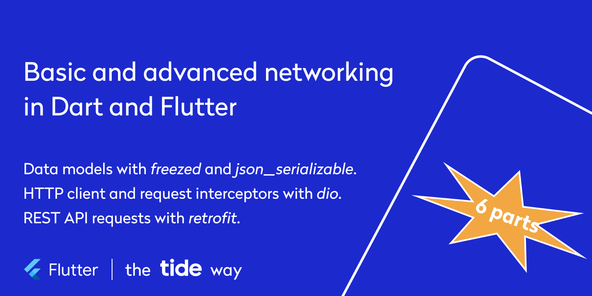
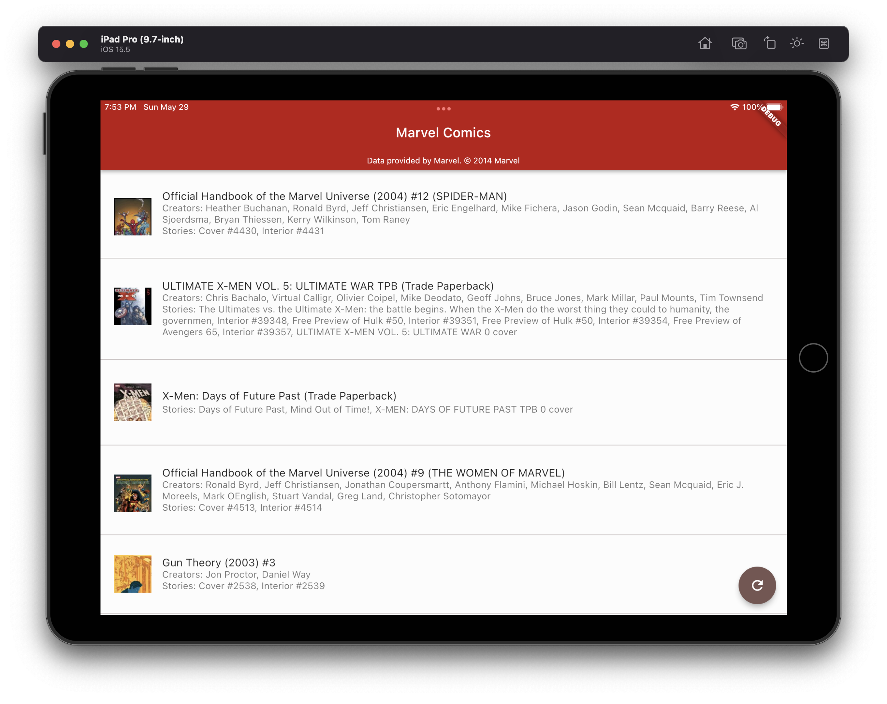

# Basic and advanced networking in Dart and Flutter - the Tide way

Most applications, be it mobile, web, or desktop, depend on some kind of backend. Thus, an API layer is an integral part of application implementation.

This six-part series presents tools and approaches that facilitate API layer implementation in Flutter and Dart applications we use at Tide... [Read on Medium](https://medium.com/@foxanna/basic-and-advanced-networking-in-dart-and-flutter-the-tide-way-part-0-introduction-33ac040a4a1c)

## Marvel comics 

Find the source code for the Flutter application that displays a list of Marvel comics obtained from [Marvel Comic API](https://developer.marvel.com/) under `marvel_comics` folder.

